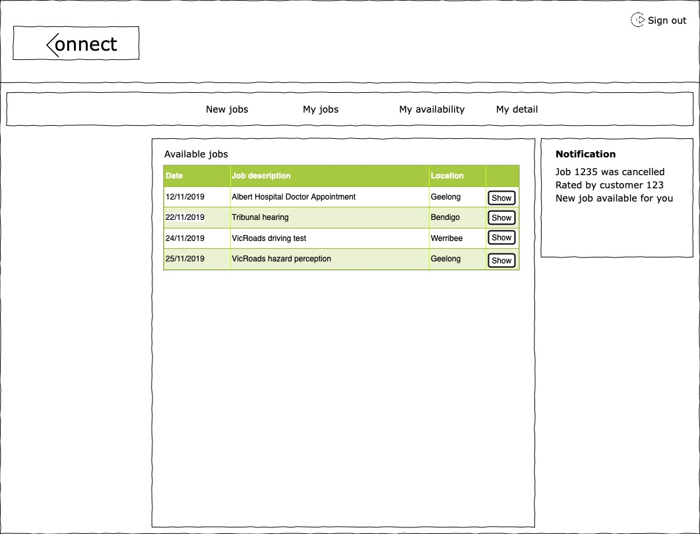
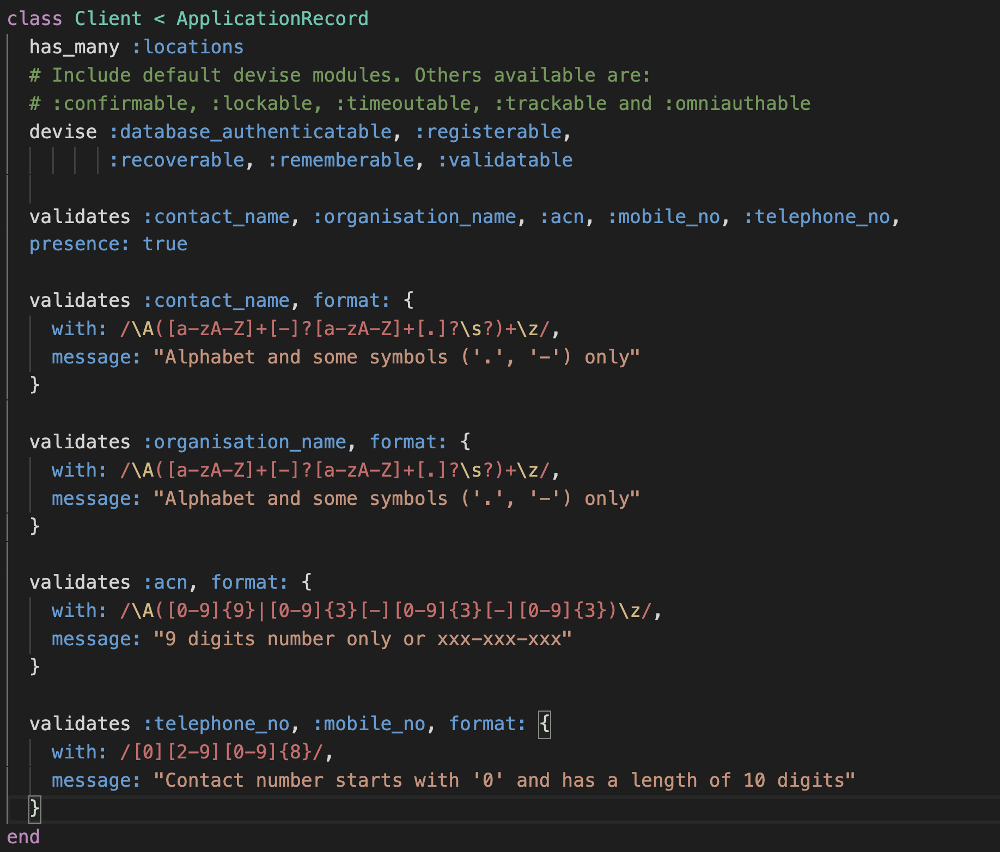

JACK TOKE
=========================

QONNEX - Interpreter Booking Service
------------------------------------

* [Heroku Site](https://nameless-tor-35350.herokuapp.com)
* [GitHub Site](https://github.com/jackptoke/qonnect)
* Ruby version 6.0.0
* Tech stack
    + Rails 6.0.0
    + HTML
    + CSS
    + PostgreSQL
    + Ruby 2.6.3p62
    + Amazon Webhosting Service (AWS)
    + Heroku PaaS (platform as a service)
* Database Used - PostgreSQL

### Introduction ###

When I first came to Australia, my first paid job was working as a contracted interpreter for various Interpreting and Translating agencies.  Every agency paid me at different rates.  The nature of the work required me to travel all over Melbourne, but at my own expenses.  I might have a job in Heilderberg Hospital for 90 minutes and the next job could be in Geelong for another 90 minutes.  There were only so many jobs I could take each day.  I had no bargaining power nor the ability to set my own rates.  I would say, we were pretty much underpaid.

It would be great to be able to bypass the booking agencies, set our own rates, increase our income, offer our customer better value for their money.

### Why is it a problem need solving ###

Every year there are millions of tourists and international students sojourning in Australia.  Often time misfortunes happen and these decent human beings may end up in hospital, or in the courthouse and they need to be able to communicate effectively with the professionals or authorities they are seeing. There is a need for easier access to interpreting service.

On the other hand, interpreters need to make decent living wage that will enable them to continue to provide this valueable service.  If they can't take home at least $200 a day, that is the minimum wages in Australia, then the future of this career is not very bright.  We will continue to lose capable interpreters, like myself, as they turn to other career that help them earn more.

Currently, interpreters are paid $50-$67/booking.  If they need to pay for their own travel expenses, and they can only take 1-3 jobs a day.  Then they are making much less than the minimum wages.  Only student will be attracted to this sort of work.  Those with good communication skills will seek other employments.  And this may impact the services being offered by hospital, clinics, schools etc.

Imagine being misdiagnosed because your interpreter has conveyed the wrong message to the doctor.  The consequence is far reaching.

### Purpose of QONNEX ###

The purpose of QONNEX are

1. To make it easier to connect interpreters and where the service is needed
2. To enable interpreters to set their own rates
3. To allow interpreters to choose jobs that fit their schedules
4. To enable clients to choose their prefered interpreters

### Target Audience ###

1. Professional interpreters, para-professional interpreters or anyone that would like to become an interpreter
2. The clients are schools, hospitals, legal services, magistrate courts and other government services

### Function/Features ###

#### Interpreter ####

* Sign-up
* Add address
* Add language(s) they would like to offer the service
* Check for available jobs
* Indicates that he/she is availabe to take the job
* Return the job, if situation changes that he can't fulfill the job
* Update his/her address
* Update his/her personal detail and password

#### Client ####

* Sign-up for an account
* Add an address in connection the organisation
* Make a request for interpreter (new job booking)
* Change the booking detail (this is allowed only if no interpreter has been assigned to it yet)
* Cancel a job booking
* View the current job bookings
* View the past job bookings
* Add new address location that may be used for booking request
* Remove an address that is no longer needed
* Update the contact detail of the organisation

### Sitemap ###

### User Stories and Screenshots ###

#### Interpreter ####

Interpreter can sign themselves up and set their own rate at which they want to be paid, add a picture of themselves and other necessary information.

Once signed-up, the interpreter will be required to add an address. The suburb name only takes alphabets or words.  Number or any other symbol will be rejected.  The postcode only takes 4 digits numbers.
Once an address is added, the "New Address" page will never show up again. Interpreter can later update or change the address, but address cannot be deleted, so such option is not given.

Once an address has been added, the interpreter will have to add the language he/she wants to offer the service.

The person can add more than one language, if he wishes to.

Once a language has been added, the interpreter can check for available jobs.  If no language is added, no job will be availabe to the person.  Only jobs in the language that the person offer, will be displayed to ther person.

The "available" button beside each job is for the interpreter to click, if he wants to indicate that he's availabe to take the job.  The job won't be assigned to him until client confirm the booking.

Once the client has confirmed the booking, the job will show up on the "Current Jobs" page.  At this point, should the interpreter wish to return the job for whatever reason, he can do so.

On the day of the appointment, the interpreter can visit the "Current Jobs" page, click "Show" to see the detail.  There is an "Arrived" button for him to click, to indicate that he's arrived at the job site.  

Once he's clicked that, another button, "Start", will show up to indicate when the job has started.  The system will take the current time when the button was clicked as the time the job has started.

Once he's done that, another button, "Finished", will show up for him to click to record the time the job is completed.  

After clicking, "Finished", the interpreter can also write a remark or note about the job he's just completed.

Once a remark has been added and saved, the job would now be visible in the "Past Jobs" page.  

On the "Personal Detail" page, interpreter can update his email address, avatar image, name and other detail.

#### Client ####

On the side of the client, a signup page is also available.  The information collected are a little different, as can be seen on the Client's "Sign-up Form".

Once logged in, just like interpreter, the client must add an address location before a new job booking could be made. 

With an address added, client can assign the new job booking to the address added earlier.  A language must be chosen, number of interpreter specified and other information about the job be entered, for a new booking to go through.  

Once a job request is submitted, interpreter who offer the language will be able to see it on their "Available jobs" page.  If he would like to take the job, he can click "Available".  He will then have to wait for the client to confirm the booking.

On the side of the client, he will see the a similar page as the following when he click to view the job on his "Current bookings" page.  All the interpreters that have indicated their availability, will appear up there for the client to confirm.

Client can click on the interpreter to see more information about him/her.  Then click on the "Book this interpreter" button to confirm the booking.

Once confirmed the interpreter will show up under the "Booked Interpreter" on the page.

The last page that a client has access to is, "Client Detail" page, which allow the client to update information about the contact person, contact number and ACN number.

The last thing I want to talk about is that I don't allow users, both interpreter and client, to delete their accounts themselves once signed up.  System admin will have to do that for them.  For the interpreter, they must always have an address, so they can't delete their address either.  They can change it, but just not delete.

### Wireframes ###

**Home Page**

**User Sign-up Page**

**Interpreter Index Page**

**Client New Booking Page**

**Interpreter Current Jobs Page**

### ERD ###

Below is the ERD of the tables I have implemented.  I will start discussing tables that are in direct connection with the **INTERPRETER**.  I will then go on to discuss tables that are in direct connection with the **CLIENT**.

#### Interpreter ####

* Every interpreter must have an address and of course an address can only belong to one interpreter.
* An interpreter can offer more than one dialects; a dialect can be spoken by many interpreters; and thus exists the joining table "User_language"
* A language can have many dialect, but a dialect can only belong to one language.
* An interpreter can indicate his availability to many jobs, and many jobs can have many available interpreters.  To make the many-to-many relationship possible, "Available interpreter" was introduced.
* A job can have many booked interpreters, depending on the number of interpreters requested at the time of the booking.

#### Client ####

* A client can have many address locations.
* A client can have many job bookings, but a job booking must belong to only one client.
* A job booking must have an address and an address can possibly have many jobs being booked at the location.

### Schema ###

### Models ###

### Project Planning: Trello ###
**First stage:**

**Second stage:**

**Third stage:**
At this stage I realised that I won't be able to use dynamic dropdown list to filter the dialects based on the language they belong to, without using Javascript.  So I have to change my design a little bit.
I also tried to implement signature gem, but I can't do it, because the gem only support Rails 5.2 and below.  I'm using Rails 6.0.0, so I have to abandon the idea of allowing client to give a signature to the interpreter.

**Fourth stage:**

**Fifth stage:**
I just realised that I haven't thought about allowing Client to make booking request only for the languages that already have interpreters.  All other languages will not be available for a new job request until an interpreter for the language has signed up.
]
 **Sixth stage:**

**Fifth stage:**
